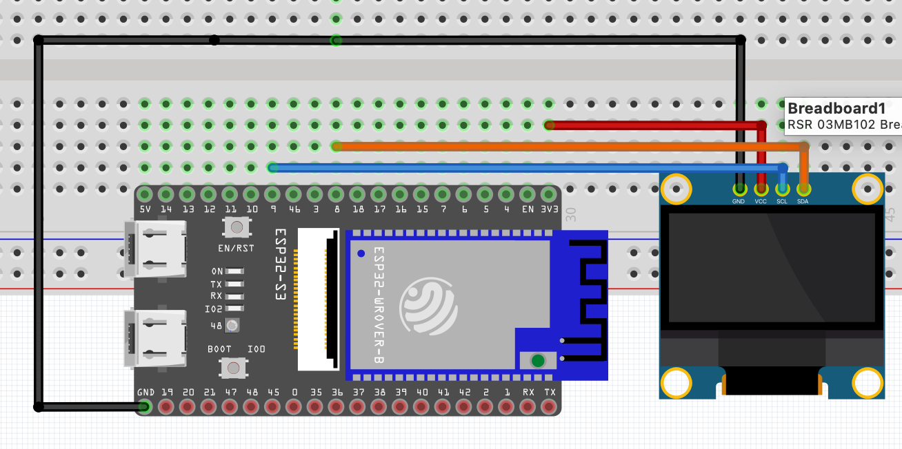

# ESP32 FFT TIME

Proyecto: **Captura y visualización de señales con el ADC interno del ESP32 + FFT + dashboard web + OLED**

Desarrollado y documentado por [alvaro-salazar](https://github.com/alvaro-salazar)

---

## ¿Qué hace este proyecto?

- Lee señales analógicas (0‑3.3 V) usando el ADC interno del ESP32 con muestreo preciso mediante timer de hardware.
- Procesa bloques de 1024 muestras con FFT en el segundo núcleo.
- Visualiza en tiempo real la señal y su espectro (dB) en un dashboard web moderno y en una pantalla OLED.
- Todo el código es abierto, modular y fácil de modificar.

---

## Requisitos rápidos

- **Placa ESP32-S3 DevKit** (probado con ESP32-S3-DevKitC-1).
- VS Code + extensión PlatformIO.
- Navegador moderno (Chrome, Edge, Firefox).
- Pantalla OLED I2C (opcional, pero recomendado).
- Cable USB decente.
- **Bonjour** (para usar mDNS con `.local` en Windows - ver sección de instalación más abajo).

---

## Conexiones




## Cómo clonar y abrir

```sh
git clone https://github.com/alvaro-salazar/esp32-fft-web.git
cd esp32-fft-web
code .
```
PlatformIO detecta el proyecto al abrir VS Code.

---

## Librerías (se descargan solas)

- arduinoFFT
- ESP Async WebServer
- AsyncTCP
- Adafruit SSD1306 (para OLED)
- Adafruit GFX

No tienes que instalar nada manualmente, `platformio.ini` ya lo gestiona.

---

## Compilar y flashear

1. Compilar y subir firmware:
   ```sh
   pio run -t upload
   ```
2. Subir los archivos web (carpeta `data/`):
   ```sh
   pio run -t uploadfs
   ```
3. Pulsa RESET en la placa.

### Nota para ESP32-S3-WROOM-1-N4R2

Si tienes una placa **ESP32-S3-WROOM-1-N4R2**, necesitas descomentar las líneas de configuración al final del archivo `platformio.ini`. Estas líneas configuran correctamente la memoria flash y PSRAM para esta placa específica.

---

## Abrir el dashboard

- **Modo AP:** el ESP crea la red **FFT‑ESP32**. Conéctate y abre `http://192.168.4.1/`.
- **Modo STA:** (si configuras tu Wi‑Fi) mira la IP en el monitor serie, por ejemplo: `http://192.168.0.23/`.
- También responde por mDNS: `http://fft32.local/` (requiere Bonjour en Windows, ver sección siguiente).

---

## Instalar Bonjour en Windows (para mDNS con .local)

Para que funcione `http://fft32.local/` en Windows, necesitas instalar **Bonjour Print Services** de Apple:

### Opción 1: Instalador oficial de Apple (recomendado)

1. Descarga el instalador desde el sitio oficial de Apple:
   - **Enlace directo:** [Bonjour Print Services para Windows](https://support.apple.com/kb/DL999?locale=es_ES)
   - O busca "Bonjour Print Services Windows" en Google

2. Ejecuta el instalador (`BonjourPSSetup.exe`)

3. Sigue el asistente de instalación (acepta los términos y condiciones)

4. Reinicia tu navegador después de la instalación

5. Ahora deberías poder acceder a `http://fft32.local/` sin problemas

### Opción 2: Usando Chocolatey (si lo tienes instalado)

```powershell
choco install bonjour
```

### Verificar que funciona

Después de instalar Bonjour, abre una terminal (PowerShell o CMD) y ejecuta:

```powershell
ping fft32.local
```

Si ves respuestas del ESP32, Bonjour está funcionando correctamente.

**Nota:** En Linux y macOS, mDNS funciona nativamente (Avahi en Linux, Bonjour incluido en macOS).

---

## Estructura de carpetas

```
src/        Código principal (main.cpp, tareas, drivers)
data/       index.html + assets web
include/    headers opcionales
platformio.ini
README.md   este archivo
```

---

## Flujo del código

- **Core 0:** Timer de hardware dispara interrupciones cada 1ms (1000 Hz) → lee ADC → almacena en buffer → envía bloques completos a cola FreeRTOS.
- **Core 1:** Procesa bloques de 1024 puntos → ventana Hamming + FFT → calcula magnitud.
- Calcula la magnitud y la manda junto al bloque de tiempo crudo por WebSocket.
- `index.html` dibuja dos gráficas con Chart.js:
  - Voltaje en tiempo (0‑3.3 V).
  - FFT en eje vertical dB (0 dB arriba, –120 dB abajo).
- El dashboard es responsive: se adapta a móvil y a pantalla full‑HD.
- La pantalla OLED muestra el espectro en tiempo real, con autoescalado y etiquetas útiles.

### Cambios para ESP32-S3

Este proyecto ha sido adaptado específicamente para **ESP32-S3**:
- Usa timer de hardware para muestreo preciso (1000 Hz) en lugar de I²S con ADC built-in (no disponible en S3).
- Implementación optimizada con buffers estáticos para evitar stack overflow.
- Compatible con el framework de Arduino estándar.

---

## Cosas por hacer / ideas

- Agregar filtrado FIR/IIR en tiempo real (el código ya tiene el punto exacto para insertarlo).
- Guardar los datos en microSD.
- Enviar por MQTT a un broker externo.
- Usar un front‑end analógico real (ADS1299) para EEG serio.
- Mejorar la visualización OLED con animaciones o más info.

---

## Autor

**Alvaro Salazar**  
[github.com/alvaro-salazar](https://github.com/alvaro-salazar)

© 2025
